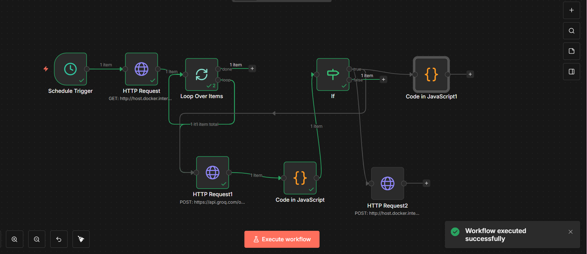

# 🚀 AI Incident Response System

An end-to-end AI-powered automation system that analyzes incidents, classifies severity, and triggers actions automatically using LLMs.

---

## 🧠 Features

* 🔍 AI-based incident analysis (P1–P4 severity)
* ⚡ Automated decision making (alert / log_only / escalate)
* 🔄 Workflow automation using n8n
* 🌐 REST API backend using Flask
* 🛡️ Safe fallback handling for AI failures
* 📊 Decision storage and tracking

---

## 🏗️ Architecture

```
Incident → Flask API → n8n Workflow → Groq LLM → Decision Engine → Storage
```

---

## ⚙️ Tech Stack

* Python (Flask)
* n8n (workflow automation)
* Groq LLM API
* REST APIs

---

## 🚀 How it works

1. Incident is sent to Flask API
2. n8n fetches incident data
3. AI analyzes severity and action
4. Decision is validated and stored
5. Alerts triggered if critical

---

## 🔄 n8n Workflow Setup

1. Open n8n → http://localhost:5678
2. Import `n8n/workflow.json`
3. Add your Groq API key
4. Activate workflow

---

## 🔐 Environment Setup

Create `.env` file:

```
GROQ_API_KEY=your_api_key_here
```

---

## ⚠️ Disclaimer

This is a prototype system designed to demonstrate AI-driven automation pipelines. Not production-ready.

---

## 💡 Future Improvements

* Retry mechanism for API failures
* Database integration
* Real-time alert systems (Slack, Email)
* Model optimization

---

## 👨‍💻 Author

Abionyx21


